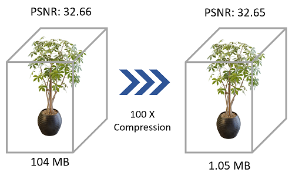
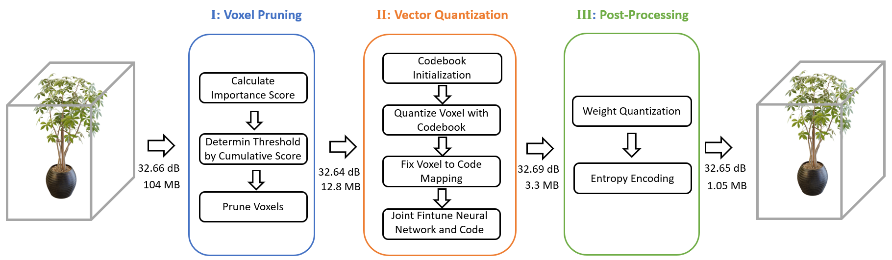

# Compressing Volumetric Radiance Fields to 1 MB

<a href="https://openaccess.thecvf.com/content/CVPR2023/html/Li_Compressing_Volumetric_Radiance_Fields_to_1_MB_CVPR_2023_paper.html"></a>

Lingzhi Li*, Zhen Shen*, Zhongshu Wang, Li Shen, Liefeng Bo

Alibaba Group






**Note**: This repository only contain VQ-TensoRF. 
VQ-DVGO please refer to [VQRF](https://github.com/AlgoHunt/VQRF)


## Setup

- Download datasets:
        [NeRF](https://drive.google.com/drive/folders/128yBriW1IG_3NJ5Rp7APSTZsJqdJdfc1), 
        [NSVF](https://dl.fbaipublicfiles.com/nsvf/dataset/Synthetic_NSVF.zip),  [T&T (masked)](https://dl.fbaipublicfiles.com/nsvf/dataset/TanksAndTemple.zip), [LLFF](https://drive.google.com/drive/folders/128yBriW1IG_3NJ5Rp7APSTZsJqdJdfc1)


- Install required libraries, Please refer to [TensoRF](https://github.com/apchenstu/TensoRF)


Please  install the correct version of [Pytorch](https://pytorch.org/) and [torch_scatter](https://github.com/rusty1s/pytorch_scatter) for your machine.

## Directory structure for the datasets

<!-- <details>
  <summary> (click to expand;) </summary> -->
```
data
├── nerf_synthetic     # Link: https://drive.google.com/drive/folders/128yBriW1IG_3NJ5Rp7APSTZsJqdJdfc1
│   └── [chair|drums|ficus|hotdog|lego|materials|mic|ship]
│       ├── [train|val|test]
│       │   └── r_*.png
│       └── transforms_[train|val|test].json
│
├── Synthetic_NSVF     # Link: https://dl.fbaipublicfiles.com/nsvf/dataset/Synthetic_NSVF.zip
│   └── [Bike|Lifestyle|Palace|Robot|Spaceship|Steamtrain|Toad|Wineholder]
│       ├── intrinsics.txt
│       ├── rgb
│       │   └── [0_train|1_val|2_test]_*.png
│       └── pose
│           └── [0_train|1_val|2_test]_*.txt
│
├── nerf_llff_data     # Link: https://drive.google.com/drive/folders/128yBriW1IG_3NJ5Rp7APSTZsJqdJdfc1
│   └── [fern|flower|fortress|horns|leaves|orchids|room|trex]
│       ├── poses_bounds.npy
│       └── images
│
└── TanksAndTemple     # Link: https://dl.fbaipublicfiles.com/nsvf/dataset/TanksAndTemple.zip
    └── [Barn|Caterpillar|Family|Ignatius|Truck]
        ├── intrinsics.txt
        ├── rgb
        │   └── [0|1|2]_*.png
        └── pose
            └── [0|1|2]_*.txt
    
```


<!-- </details> -->

## Training & VectQuantize & Testing

The training script is in `vectquant.py`.

For example, to train a VectQuantized model on the synthetic dataset:

```
python vectquant.py --config configs/vq/syn.txt --datadir {syn_dataset_dir}/hotdog --expname hotdog --basedir ./log_reimp/syn --render_path 0 --render_only 0 --ckpt ./log_reimp/syn/hotdog/hotdog.th
```

The process of the training script is divided into three steps:
* **Step 1**: Train a baseline model and save the model checkpoint. (Follow the vinilla TensoRF training pipeline)
* **Step 2**: Train a VectQuantized model with the baseline model checkpoint from Step 1 and save the VectQuantized model checkpoint.
* **Step 3**: Test the VectQuantized model checkpoint from Step 2.


More options refer to the `opt.py`.

## Autotask for a dataset

`python autotask_vq.py -g "0 1 2 3" --dataset {dataset_name} --suffix v0`

Modify your `data` directory in `DatasetSetting`.

Set `dataset_name`, choices = ['syn', 'nsvf', 'tt', 'llff'].

Set `-g` option according to the availible gpus on your machine. 

> Notice: When you run the autotask script with multiple gpus, maybe the bottleneck is the disk IO for data loading.

## Testing the VectQuantized model

```
python eval_vq_only.py --autotask --config configs/vq/syn.txt --datadir {syn_dataset_dir} --ckpt {VQ_model_checkpoint}

```
 

## Acknowledgements
In this repository, we have used codes from the following repositories. 
* [TensoRF](https://github.com/apchenstu/TensoRF)
* [vector-quantize-pytorch](https://github.com/lucidrains/vector-quantize-pytorch)

## Citation
If you find our work useful in your research, please consider citing:

```
@inproceedings{li2023compressing,
  title={Compressing volumetric radiance fields to 1 mb},
  author={Li, Lingzhi and Shen, Zhen and Wang, Zhongshu and Shen, Li and Bo, Liefeng},
  booktitle={Proceedings of the IEEE/CVF Conference on Computer Vision and Pattern Recognition},
  pages={4222--4231},
  year={2023}
}
```